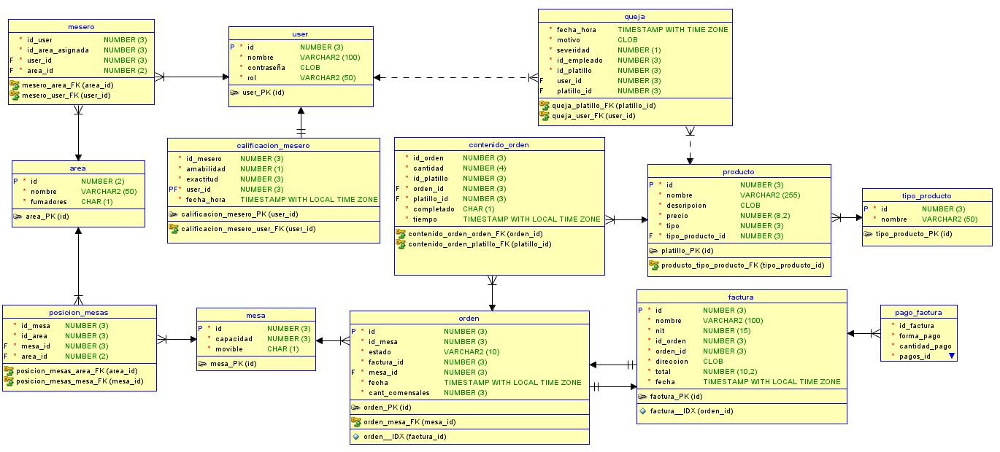

# proyecto2_BD1

Proyecto 2 de base de datos 1. Desarrollo del sistema de un restaurante.

## Comandos que instalarán las dependencias requeridas

- npm install
- npm install express  
- npm install pg
- npm install cors

## Comandos requeridos para ejecutar el servicio backend

- docker compose up (pude correrse en detached añadiendo la flag "-d")
- npm start

## Base de datos

Diagrama lógico

Diagrama relacional

### Descripcion base de datos

<table>
    <tr>
            <th colspan = "3">Tablas</th>
        </tr>
        <tr>
            <th>Tabla</th>
            <th>Atributo</th>
            <th>Descripción</th>
        </tr>
        <tr>
            <td rowspan="4">users</td>
            <td>id</td>
            <td>Identificador único del usuario</td>
        </tr>
        <tr>
            <td>username</td>
            <td>Nombre de usuario único</td>
        </tr>
        <tr>
            <td>password</td>
            <td>Contraseña del usuario</td>
        </tr>
        <tr>
            <td>rol</td>
            <td>Rol o nivel de acceso del usuario</td>
        </tr>
        <tr>
            <td rowspan="2">mesero</td>
            <td>id_user</td>
            <td>ID del usuario asignado como mesero</td>
        </tr>
        <tr>
            <td>id_area_asignada</td>
            <td>ID del área asignada al mesero</td>
        </tr>
        <tr>
            <td rowspan="3">area</td>
            <td>id</td>
            <td>Identificador único del área</td>
        </tr>
        <tr>
            <td>nombre</td>
            <td>Nombre del área</td>
        </tr>
        <tr>
            <td>fumadores</td>
            <td>Indica si el área permite fumadores</td>
        </tr>
        <tr>
            <td rowspan="3">mesa</td>
            <td>id</td>
            <td>Identificador único de la mesa</td>
        </tr>
        <tr>
            <td>capacidad</td>
            <td>Número máximo de comensales que puede albergar la mesa</td>
        </tr>
        <tr>
            <td>movible</td>
            <td>Indica si la mesa es movible o no</td>
        </tr>
        <tr>
            <td rowspan="2">posicion_mesas</td>
            <td>id_mesa</td>
            <td>ID de la mesa</td>
        </tr>
        <tr>
            <td>id_area</td>
            <td>ID del área donde está ubicada la mesa</td>
        </tr>
        <tr>
            <td rowspan="5">calificacion_mesero</td>
            <td>id</td>
            <td>Identificador único de la calificación</td>
        </tr>
        <tr>
            <td>id_mesero</td>
            <td>ID del mesero calificado</td>
        </tr>
        <tr>
            <td>amabilidad</td>
            <td>Puntuación de amabilidad del mesero (0-5)</td>
        </tr>
        <tr>
            <td>exactitud</td>
            <td>Puntuación de exactitud del mesero (0-5)</td>
        </tr>
        <tr>
            <td>fecha_hora</td>
            <td>Fecha y hora de la calificación</td>
        </tr>
        <tr>
            <td rowspan="6">queja</td>
            <td>id</td>
            <td>Identificador único de la queja</td>
        </tr>
        <tr>
            <td>fecha_hora</td>
            <td>Fecha y hora de la queja</td>
        </tr>
        <tr>
            <td>motivo</td>
            <td>Motivo de la queja</td>
        </tr>
        <tr>
            <td>severidad</td>
            <td>Grado de severidad de la queja (0-5)</td>
        </tr>
        <tr>
            <td>id_empleado</td>
            <td>ID del empleado relacionado con la queja</td>
        </tr>
        <tr>
            <td>id_producto</td>
            <td>ID del producto relacionado con la queja</td>
        </tr>
        <tr>
            <td rowspan="5">producto</td>
            <td>id</td>
            <td>Identificador único del producto</td>
        </tr>
        <tr>
            <td>nombre</td>
            <td>Nombre del producto</td>
        </tr>
        <tr>
            <td>descripcion</td>
            <td>Descripción del producto</td>
        </tr>
        <tr>
            <td>precio</td>
            <td>Precio del producto</td>
        </tr>
        <tr>
            <td>tipo</td>
            <td>Tipo de producto</td>
        </tr>
        <tr>
            <td rowspan="2">tipo_producto</td>
            <td>id_tipo</td>
            <td>Identificador único del tipo de producto</td>
        </tr>
        <tr>
            <td>nombre</td>
            <td>Nombre del tipo de producto</td>
        </tr>
        <tr>
            <td rowspan="4">orden</td>
            <td>id</td>
            <td>Identificador único de la orden</td>
        </tr>
        <tr>
            <td>id_mesa</td>
            <td>ID de la mesa asociada a la orden</td>
        </tr>
        <tr>
            <td>estado</td>
            <td>Estado de la orden (abierto o cerrado)</td>
        </tr>
        <tr>
            <td>fecha</td>
            <td>Fecha de la orden</td>
        </tr>
        <tr>
            <td rowspan="5">contenido_orden</td>
            <td>id_orden</td>
            <td>ID de la orden asociada al contenido</td>
        </tr>
        <tr>
            <td>cantidad_producto</td>
            <td>Cantidad del producto en la orden</td>
        </tr>
        <tr>
            <td>id_producto</td>
            <td>ID del producto en la orden</td>
        </tr>
        <tr>
            <td>completado</td>
            <td>Indica si el producto ha sido completado</td>
        </tr>
        <tr>
            <td>tiempo</td>
            <td>Tiempo en que se ingresó el platillo a la orden</td>
        </tr>
        <tr>
            <td rowspan="7">factura</td>
            <td>id</td>
            <td>Identificador único de la factura</td>
        </tr>
        <tr>
            <td>nombre_cliente</td>
            <td>Nombre del cliente en la factura</td>
        </tr>
        <tr>
            <td>nit</td>
            <td>NIT del cliente en la factura</td>
        </tr>
        <tr>
            <td>id_orden</td>
            <td>ID de la orden asociada a la factura</td>
        </tr>
        <tr>
            <td>direccion</td>
            <td>Dirección de entrega de la factura</td>
        </tr>
        <tr>
            <td>total</td>
            <td>Total de la factura</td>
        </tr>
        <tr>
            <td>fecha</td>
            <td>Fecha de emisión de la factura</td>
        </tr>
        <tr>
            <td rowspan="4">pago_factura</td>
            <td>id</td>
            <td>Identificador único del pago de la factura</td>
        </tr>
        <tr>
            <td>id_factura</td>
            <td>ID de la factura asociada al pago</td>
        </tr>
        <tr>
            <td>forma_pago</td>
            <td>Forma de pago utilizada</td>
        </tr>
        <tr>
            <td>cantidad_pago</td>
            <td>Cantidad pagada</td>
        </tr>
    </table>

..

<table>
    <tr>
        <th colspan = "3"> Constraints </th>
    </tr>
    <tr>
        <th>Nombre del Constraint</th>
        <th>Tabla Afectada</th>
        <th>Acción</th>
    </tr>
    <tr>
        <td>fk_mesero_user_id</td>
        <td>mesero</td>
        <td>La llave foránea id_user en la tabla mesero referencia la columna id en la tabla user.</td>
    </tr>
    <tr>
        <td>fk_mesa_en_area</td>
        <td>posicion_mesas</td>
        <td>La llave foránea id_mesa en la tabla posicion_mesas referencia la columna id en la tabla mesa.</td>
    </tr>
    <tr>
        <td>fk_area_con_mesa</td>
        <td>posicion_mesas</td>
        <td>La llave foránea id_area en la tabla posicion_mesas referencia la columna id en la tabla area.</td>
    </tr>
    <tr>
        <td>fk_calificar_mesero</td>
        <td>calificacion_mesero</td>
        <td>La llave foránea id_mesero en la tabla calificacion_mesero referencia la columna id en la tabla user.</td>
    </tr>
    <tr>
        <td>fk_queja_empleado</td>
        <td>queja</td>
        <td>La llave foránea id_empleado en la tabla queja referencia la columna id en la tabla user.</td>
    </tr>
    <tr>
        <td>fk_queja_platillo</td>
        <td>queja</td>
        <td>La llave foránea id_platillo en la tabla queja referencia la columna id en la tabla platillo.</td>
    </tr>
    <tr>
        <td>fk_mesa_en_orden</td>
        <td>orden</td>
        <td>La llave foránea id_mesa en la tabla orden referencia la columna id en la tabla mesa.</td>
    </tr>
    <tr>
        <td>fk_orden</td>
        <td>contenido_orden</td>
        <td>La llave foránea id_orden en la tabla contenido_orden referencia la columna id en la tabla orden.</td>
    </tr>
    <tr>
        <td>fk_platillo_en_orden</td>
        <td>contenido_orden</td>
        <td>La llave foránea id_platillo en la tabla contenido_orden referencia la columna id en la tabla platillo.</td>
    </tr>
    <tr>
        <td>fk_orden_en_factura</td>
        <td>factura</td>
        <td>La llave foránea id_orden en la tabla factura referencia la columna id en la tabla orden.</td>
    </tr>
    <tr>
        <td>fk_factura_a_pagar</td>
        <td>pago_factura</td>
        <td>La llave foránea id_factura en la tabla pago_factura referencia la columna id en la tabla factura.</td>
    </tr>
    <tr>
        <td>fk_factura_forma_pagar</td>
        <td>pago_factura</td>
        <td>La llave foránea forma_pago en la tabla pago_factura referencia la columna id en la tabla pagos.</td>
    </tr>
</table>
