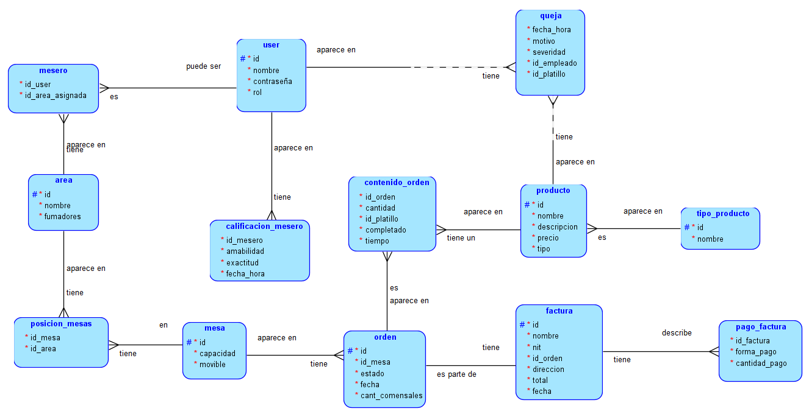

# proyecto2_BD1
Proyecto 2 de base de datos 1. Desarrollo del sistema de un restaurante

## Correr estos comandos necesarios, en la carpeta de vite-project
- npm install express  
- npm install pg      
- npm install cors    

### Para correr el backend se debe hacer
- docker compose up (pude correrse en detached)
- npm start

## Base de datos
Diagrama lógico

Diagrama relacional

