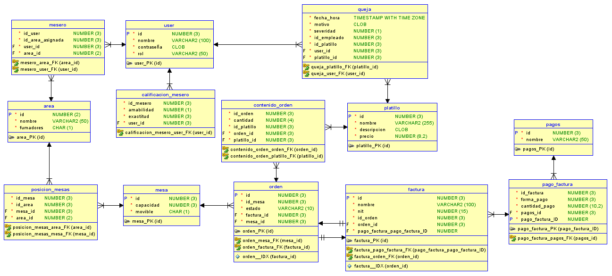

# proyecto2_BD1

Proyecto 2 de base de datos 1. Desarrollo del sistema de un restaurante

## Correr estos comandos necesarios, en la carpeta de vite-project

- npm install express  
- npm install pg
- npm install cors

## Para correr el backend se debe hacer

- docker compose up (pude correrse en detached)
- npm start

## Base de datos

Diagrama lógico

Diagrama relacional

### Descripcion base de datos

<table>
    <tr>
        <th colspan = "3" text-align: center> Tablas </th>
    </tr>
    <tr>
        <th>Tabla</th>
        <th>Atributo</th>
        <th>Descripción</th>
    </tr>
    <tr>
        <td rowspan="5">users</td>
        <td>id</td>
        <td>Identificador único del usuario</td>
    </tr>
    <tr>
        <td>username</td>
        <td>Nombre de usuario único</td>
    </tr>
    <tr>
        <td>email</td>
        <td>Dirección de correo electrónico única</td>
    </tr>
    <tr>
        <td>password</td>
        <td>Contraseña del usuario</td>
    </tr>
    <tr>
        <td>rol</td>
        <td>Rol o nivel de acceso del usuario</td>
    </tr>
    <tr>
        <td rowspan="2">mesero</td>
        <td>id_user</td>
        <td>ID del usuario asignado como mesero</td>
    </tr>
    <tr>
        <td>id_area_asignada</td>
        <td>ID del área asignada al mesero</td>
    </tr>
    <tr>
        <td rowspan="2">area</td>
        <td>id</td>
        <td>Identificador único del área</td>
    </tr>
    <tr>
        <td>nombre</td>
        <td>Nombre del área</td>
    </tr>
    <tr>
        <td rowspan="2">mesa</td>
        <td>id</td>
        <td>Identificador único de la mesa</td>
    </tr>
    <tr>
        <td>capacidad</td>
        <td>Número de personas que puede albergar la mesa</td>
    </tr>
    <tr>
        <td rowspan="2">posicion_mesas</td>
        <td>id_mesa</td>
        <td>ID de la mesa</td>
    </tr>
    <tr>
        <td>id_area</td>
        <td>ID del área donde está ubicada la mesa</td>
    </tr>
    <tr>
        <td rowspan="4">calificacion_mesero</td>
        <td>id</td>
        <td>Identificador único de la calificación</td>
    </tr>
    <tr>
        <td>id_mesero</td>
        <td>ID del mesero calificado</td>
    </tr>
    <tr>
        <td>amabilidad</td>
        <td>Puntuación de amabilidad del mesero (0-5)</td>
    </tr>
    <tr>
        <td>exactitud</td>
        <td>Puntuación de exactitud del mesero (0-5)</td>
    </tr>
    <tr>
        <td rowspan="6">queja</td>
        <td>id</td>
        <td>Identificador único de la queja</td>
    </tr>
    <tr>
        <td>fecha_hora</td>
        <td>Fecha y hora de la queja (por defecto, la hora del sistema)</td>
    </tr>
    <tr>
        <td>motivo</td>
        <td>Motivo de la queja</td>
    </tr>
    <tr>
        <td>severidad</td>
        <td>Grado de severidad de la queja (0-5)</td>
    </tr>
    <tr>
        <td>id_empleado</td>
        <td>ID del empleado relacionado con la queja</td>
    </tr>
    <tr>
        <td>id_platillo</td>
        <td>ID del platillo relacionado con la queja (puede ser nulo)</td>
    </tr>
    <tr>
        <td rowspan="4">platillo</td>
        <td>id</td>
        <td>Identificador único del platillo</td>
    </tr>
    <tr>
        <td>nombre</td>
        <td>Nombre del platillo</td>
    </tr>
    <tr>
        <td>descripcion</td>
        <td>Descripción del platillo</td>
    </tr>
    <tr>
        <td>precio</td>
        <td>Precio del platillo</td>
    </tr>
    <tr>
        <td rowspan="2">orden</td>
        <td>id</td>
        <td>Identificador único de la orden</td>
    </tr>
    <tr>
        <td>id_mesa</td>
        <td>ID de la mesa asociada a la orden</td>
    </tr>
    <tr>
        <td rowspan="3">contenido_orden</td>
        <td>id_orden</td>
        <td>ID de la orden</td>
    </tr>
    <tr>
        <td>cantidad</td>
        <td>Cantidad del platillo en la orden</td>
    </tr>
    <tr>
        <td>id_platillo</td>
        <td>ID del platillo en la orden</td>
    </tr>
    <tr>
        <td rowspan="4">factura</td>
        <td>id</td>
        <td>Identificador único de la factura</td>
    </tr>
    <tr>
        <td>nombre_cliente</td>
        <td>Nombre del cliente asociado a la factura</td>
    </tr>
    <tr>
        <td>nit</td>
        <td>NIT del cliente asociado a la factura</td>
    </tr>
    <tr>
        <td>id_orden</td>
        <td>ID de la orden asociada a la factura</td>
    </tr>
    <tr>
        <td rowspan="3">pago_factura</td>
        <td>id_factura</td>
        <td>ID de la factura asociada al pago</td>
    </tr>
    <tr>
        <td>forma_pago</td>
        <td>Forma de pago utilizada, se usa numero de identificacion asignado en tabla pagos</td>
    </tr>
    <tr>
        <td>cantidad_pago</td>
        <td>Cantidad pagada</td>
    </tr>
    <tr>
        <td rowspan="2">pagos</td>
        <td>id</td>
        <td>ID del pago</td>
    </tr>
    <tr>
        <td>nombre</td>
        <td>Nombre del tipo de pago</td>
    </tr>
</table>

..

<table>
    <tr>
        <th colspan = "3"> Constraints </th>
    </tr>
    <tr>
        <th>Nombre del Constraint</th>
        <th>Tabla Afectada</th>
        <th>Acción</th>
    </tr>
    <tr>
        <td>fk_mesero_user_id</td>
        <td>mesero</td>
        <td>La llave foránea id_user en la tabla mesero referencia la columna id en la tabla user.</td>
    </tr>
    <tr>
        <td>fk_mesa_en_area</td>
        <td>posicion_mesas</td>
        <td>La llave foránea id_mesa en la tabla posicion_mesas referencia la columna id en la tabla mesa.</td>
    </tr>
    <tr>
        <td>fk_area_con_mesa</td>
        <td>posicion_mesas</td>
        <td>La llave foránea id_area en la tabla posicion_mesas referencia la columna id en la tabla area.</td>
    </tr>
    <tr>
        <td>fk_calificar_mesero</td>
        <td>calificacion_mesero</td>
        <td>La llave foránea id_mesero en la tabla calificacion_mesero referencia la columna id en la tabla user.</td>
    </tr>
    <tr>
        <td>fk_queja_empleado</td>
        <td>queja</td>
        <td>La llave foránea id_empleado en la tabla queja referencia la columna id en la tabla user.</td>
    </tr>
    <tr>
        <td>fk_queja_platillo</td>
        <td>queja</td>
        <td>La llave foránea id_platillo en la tabla queja referencia la columna id en la tabla platillo.</td>
    </tr>
    <tr>
        <td>fk_mesa_en_orden</td>
        <td>orden</td>
        <td>La llave foránea id_mesa en la tabla orden referencia la columna id en la tabla mesa.</td>
    </tr>
    <tr>
        <td>fk_orden</td>
        <td>contenido_orden</td>
        <td>La llave foránea id_orden en la tabla contenido_orden referencia la columna id en la tabla orden.</td>
    </tr>
    <tr>
        <td>fk_platillo_en_orden</td>
        <td>contenido_orden</td>
        <td>La llave foránea id_platillo en la tabla contenido_orden referencia la columna id en la tabla platillo.</td>
    </tr>
    <tr>
        <td>fk_orden_en_factura</td>
        <td>factura</td>
        <td>La llave foránea id_orden en la tabla factura referencia la columna id en la tabla orden.</td>
    </tr>
    <tr>
        <td>fk_factura_a_pagar</td>
        <td>pago_factura</td>
        <td>La llave foránea id_factura en la tabla pago_factura referencia la columna id en la tabla factura.</td>
    </tr>
    <tr>
        <td>fk_factura_forma_pagar</td>
        <td>pago_factura</td>
        <td>La llave foránea forma_pago en la tabla pago_factura referencia la columna id en la tabla pagos.</td>
    </tr>
</table>
